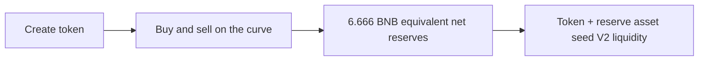

# Launch and mining economics

## Current BSC mainnet deployment

| Parameter | Value |
| --- | --- |
| Initial supply | 1 billion tokens, 18 decimals |
| Creation charge | Zero; transaction gas remains payable |
| Net graduation target | 6.666 BNB equivalent, fixed in quote-asset units at creation |
| Opening virtual BNB reserve | ceil(18 × 25 / 73) BNB |
| Opening virtual token reserve | ceil(800 million × 98 / 73) tokens |
| Project buy/sell taxes | Independently 0–5% |
| External market | PancakeSwap V2 |

Reducing the graduation target does not scale down opening virtual reserves. With virtual quote Q, virtual tokens T and net graduation target G, the sale amount is floor(T×G/(Q+G)). The contract calculates the paired assets available for liquidity after graduation deductions, then matches tokens at the graduation price. The actual remaining token balance goes to mining or the CZ transfer destination according to the selected template. At the 6.666 BNB graduation target, the remainder is about 179.2986 million tokens. The actual contract balance determines the budget.

CZ transfer is an ordinary transfer to `0x28816c4C4792467390C90e5B426F198570E29307`, preserving total supply. It is not a burn, a lock or an endorsement. The recipient can transfer the tokens and receives holder dividends if eligible.

## How the reserve asset supports a launch

The factory creates a standalone token contract; the reserve asset does not mint the token. The initial billion tokens enter the launch curve. BNB, PEPE and other supported reserve assets determine what buyers pay and sellers receive.

Virtual reserves determine the curve price and cannot be withdrawn. Actual received assets fund sellbacks and graduation liquidity. For non-BNB launches, the target is converted to reserve-asset units and fixed when the token is created. After liquidity seeding, the DeFi template assigns the actual remaining tokens to mining rewards.

## DeFi mining

| Pool | Share of actual reward budget | Principal lock |
| --- | --- | --- |
| Flexible single token | 4% | None |
| Locked single token | 16% | 24 hours per deposit |
| Canonical V2 LP | 80% | 24 hours per deposit |

Template 12 fixes total mining rewards at 1:4:20 across these pools. Pool allocation does not change with participant counts or stake values. Inside each pool, participants earn in proportion to their stake; allocation ratios do not guarantee corresponding APR multiples. Old token pools retain their deployment-time budgets. Integer rounding dust remains in the LP budget so the three budgets sum to the total.

Each pool consumes 90 occupied days of release time. Its clock pauses while nobody is staked; it neither burns empty-pool rewards nor emits them as a catch-up windfall. APR varies with reward rates and staked value. Rewards are the launched token; tax dividends are the paired asset. These are different revenue mechanisms.

Before the 24-hour unlock, early principal withdrawal deducts 10%. Single-token deductions transfer to dEaD, preserving token totalSupply. LP deductions transfer the LP receipt to dEaD, permanently locking the corresponding liquidity in the V2 pool; they do not call pair.burn or remove underlying liquidity. The platform receives none of these deductions, and locking LP does not create additional liquidity. Mature withdrawals, flexible withdrawals and accrued rewards have no early-exit deduction. Existing immutable pools retain their original rules.

## Reading the displayed APR

For a populated pool, daily token emission is its fixed reward budget divided by 90 active days. APR is `daily emission × reward-token price × 365 ÷ current staked principal value`. LP principal includes both underlying assets. This annualizes the current rate; it does not promise a year of rewards or automatic compounding. Participation and asset prices change the estimate. The 1:4:20 budget ratio does not fix APR ratios across pools.

The [current rules snapshot](current-rules.json) is shared with the website documentation. For a specific existing token, read its own deployed contracts.
